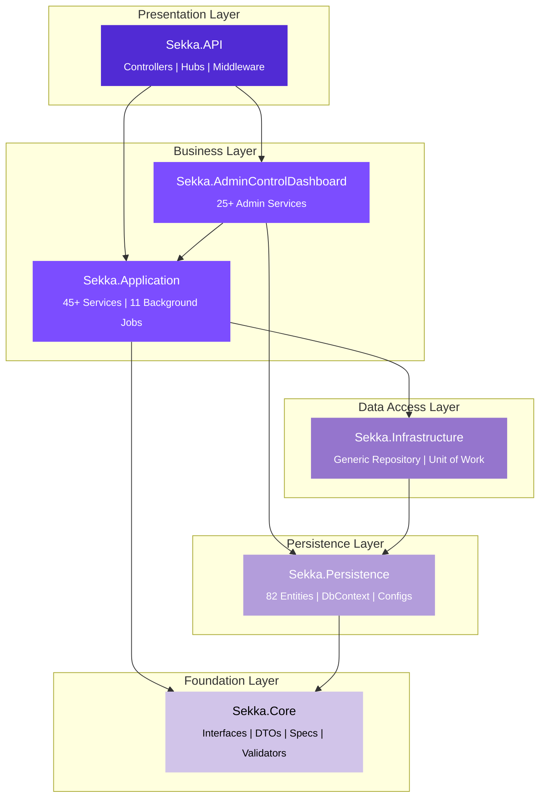
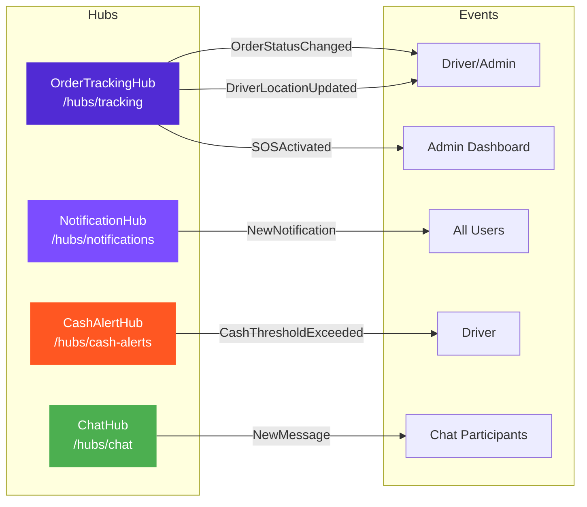
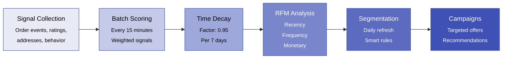

<div align="center">

<br/>

<picture>
  <source media="(prefers-color-scheme: dark)" srcset="https://readme-typing-svg.herokuapp.com?font=Fira+Code&weight=700&size=40&pause=1000&color=6C63FF&center=true&vCenter=true&random=false&width=500&height=70&lines=%D8%B3%D9%83%D9%91%D8%A9+%E2%80%94+Sekka.API">
  
</picture>

<br/>

**Smart Delivery Management Platform — Backend API**

<p>
A production-grade backend powering intelligent delivery operations across Egypt.<br/>
Built with .NET 8.0 Clean Architecture, real-time tracking, and AI-driven customer insights.
</p>

<br/>

<a href="#-quick-start"></a>
<a href="#-api-surface"></a>
<a href="#-architecture"></a>

<br/><br/>


<br/><br/>

<table>
<tr>
<td align="center"><br/><sub><b>Endpoints</b></sub></td>
<td align="center"><br/><sub><b>Services</b></sub></td>
<td align="center"><br/><sub><b>DB Tables</b></sub></td>
<td align="center"><br/><sub><b>DTOs</b></sub></td>
<td align="center"><br/><sub><b>Realtime Hubs</b></sub></td>
<td align="center"><br/><sub><b>BG Services</b></sub></td>
</tr>
</table>

</div>

<br/>

---

<br/>

##  Overview

> **Sekka** (Arabic: سكّة — "path/track") is a comprehensive delivery management platform designed specifically for the Egyptian market. It provides delivery drivers with intelligent tools for order management, route optimization, financial tracking, and customer engagement — all powered by a robust .NET 8.0 backend.

### Key Capabilities

<table>
<tr>
<td width="50%">

**Driver Operations**
- Full order lifecycle (create → deliver/cancel)
- Smart route optimization with live tracking
- Bulk order import from clipboard/OCR
- "Is it worth it?" order value calculator
- Shift management & break advisor

</td>
<td width="50%">

**Financial System**
- Digital wallet with real-time balance
- Cash safety alerts & thresholds
- Settlement tracking & approval
- Surge pricing engine
- Savings circles (Gamiyya)

</td>
</tr>
<tr>
<td width="50%">

**Customer Intelligence**
- Interest scoring with time decay
- RFM analysis (Recency/Frequency/Monetary)
- Smart customer segmentation
- Targeted campaign engine
- Personalized recommendations

</td>
<td width="50%">

**Admin Dashboard**
- Real-time operations monitoring
- Driver/order/finance management
- SOS alert handling & escalation
- Dispute resolution system
- Full audit trail & analytics

</td>
</tr>
</table>

<br/>

---

<br/>

##  Architecture

<div align="center">



</div>

> [!NOTE]
> **Sekka.Core** has zero external dependencies. Each layer only references the layers below it, ensuring strict separation of concerns and testability.

<br/>

---

<br/>

##  Tech Stack

<table>
<tr><td><b>Category</b></td><td><b>Technology</b></td><td><b>Purpose</b></td></tr>
<tr><td></td><td>ASP.NET Core Web API</td><td>Application framework</td></tr>
<tr><td></td><td>EF Core 8.0 (Code-First)</td><td>Primary database + ORM</td></tr>
<tr><td></td><td>StackExchange.Redis</td><td>Cache, OTP, JWT blacklist, distributed locks</td></tr>
<tr><td></td><td>ASP.NET SignalR + Redis Backplane</td><td>Real-time communication (4 hubs)</td></tr>
<tr><td></td><td>ASP.NET Identity + JWT Bearer</td><td>OTP-based phone authentication</td></tr>
<tr><td></td><td>AutoMapper 16+</td><td>Entity ↔ DTO mapping</td></tr>
<tr><td></td><td>FluentValidation 12+</td><td>Request validation with Egyptian phone rules</td></tr>
<tr><td></td><td>Swashbuckle + API Versioning</td><td>Interactive API documentation</td></tr>
<tr><td></td><td>Firebase Cloud Messaging</td><td>Push notifications</td></tr>
<tr><td></td><td>Dart + Bloc/Riverpod</td><td>Mobile client (iOS & Android)</td></tr>
</table>

<br/>

---

<br/>

##  Project Structure

```
Sekka.API.sln
│
├── Sekka.Core/                           Contracts & Abstractions (zero dependencies)
│   ├── Common/                           Result<T>, ApiResponse<T>, PagedResult<T>, EgyptianPhoneHelper
│   ├── DTOs/                             452+ Data Transfer Objects (12 subfolders)
│   ├── Enums/                            82+ Enumerations
│   ├── Interfaces/
│   │   ├── Services/                     Service contracts (IOrderService, IWalletService, ...)
│   │   └── Persistence/                  IGenericRepository<T,TKey>, IUnitOfWork
│   ├── Specifications/                   ISpecification<T>, BaseSpecification<T>
│   ├── Validators/                       FluentValidation rules + MustBeEgyptianMobile()
│   └── Mapping/                          AutoMapper profiles
│
├── Sekka.Persistence/                    Data Layer
│   ├── Entities/Base/                    BaseEntity → AuditableEntity → SoftDeletableEntity
│   ├── Configurations/                   EF Core Fluent API configurations
│   ├── Interceptors/                     AuditInterceptor (auto audit trail)
│   ├── Seeds/                            JSON seed data (regions, vehicle types, ...)
│   └── SekkaDbContext.cs                 Global soft-delete filter
│
├── Sekka.Infrastructure/                 Data Access Implementation
│   ├── Repositories/                     GenericRepository + SpecificationEvaluator
│   └── UnitOfWork.cs                     Transaction management
│
├── Sekka.Application/                    Business Logic
│   ├── Services/Base/                    BaseService<TEntity, TDto, TCreateDto, TUpdateDto>
│   ├── Services/                         45+ domain services
│   └── BackgroundServices/               11 hosted services (scheduled jobs)
│
├── Sekka.AdminControlDashboard/          Admin Operations
│   └── Services/                         25+ admin-specific services
│
└── Sekka.API/                            Presentation Layer
    ├── Controllers/Base/                 BaseCrudController with ToActionResult()
    ├── Controllers/Driver/               43 driver-facing controllers
    ├── Controllers/Admin/                25 admin controllers
    ├── Hubs/                             4 SignalR hubs
    ├── Middleware/                        5 custom middleware components
    ├── Extensions/                       DI registration extensions
    └── Program.cs                        Full DI + middleware pipeline
```

<br/>

---

<br/>

##  Quick Start

### Prerequisites

| Tool | Version | Required |
|------|---------|----------|
| [.NET SDK](https://dotnet.microsoft.com/download/dotnet/8.0) | 8.0+ | Yes |
| [SQL Server](https://www.microsoft.com/en-us/sql-server/sql-server-downloads) | 2019+ / LocalDB | Yes |
| [Redis](https://redis.io/download) | 7.0+ | Optional (dev) |

### Installation

```bash
# 1. Clone
git clone https://github.com/AhmedSalem104/Sekka.APIs.git
cd Sekka.APIs

# 2. Restore dependencies
dotnet restore

# 3. Configure database (edit connection string)
#    File: Sekka.API/appsettings.Development.json

# 4. Apply migrations
dotnet ef database update -p Sekka.Persistence -s Sekka.API

# 5. Run
dotnet run --project Sekka.API
```

> [!TIP]
> The API launches at `https://localhost:5001` — Swagger UI is available at `/swagger`

<br/>

---

<br/>

##  API Surface

### Driver APIs — 43 Controllers

<details>
<summary><b>Auth & Identity</b></summary>

| Endpoint | Method | Description |
|----------|--------|-------------|
| `/api/auth/send-otp` | POST | Send OTP to Egyptian mobile |
| `/api/auth/verify-otp` | POST | Verify OTP & get JWT |
| `/api/auth/register` | POST | Complete driver registration |
| `/api/auth/refresh` | POST | Rotate access + refresh token |
| `/api/auth/logout` | POST | Blacklist token via Redis |

</details>

<details>
<summary><b>Orders & Delivery</b></summary>

| Category | Controllers | Key Operations |
|----------|-------------|----------------|
| Order CRUD | OrdersController | Create, Read, Update, Delete |
| Lifecycle | OrdersController | Accept, PickUp, Deliver, Fail, Cancel |
| Bulk Import | BulkImportController | Clipboard paste → parsed orders |
| Duplicates | DuplicateController | Detect & resolve duplicate orders |
| Worth Calculator | OrderWorthController | Profit/loss analysis per order |
| Address Swap | AddressSwapController | Change delivery address mid-route |
| Waiting Timer | WaitingTimerController | Track customer waiting time |
| Cancellation | CancellationController | Cancel with loss tracking |

</details>

<details>
<summary><b>Navigation & Customers</b></summary>

| Category | Controllers | Key Operations |
|----------|-------------|----------------|
| Routes | RouteController | Optimize, reorder, add/remove stops |
| Customers | CustomerController | CRUD, merge duplicates, smart address |
| Caller ID | CallerIdController | Lookup, notes, Truecaller integration |
| Smart Address | SmartAddressController | Frequent addresses, suggestions |

</details>

<details>
<summary><b>Finance</b></summary>

| Category | Controllers | Key Operations |
|----------|-------------|----------------|
| Wallet | WalletController | Balance, transactions, transfer |
| Settlements | SettlementController | Create, approve, history |
| Payments | PaymentRequestController | VodafoneCash / InstaPay requests |
| Invoices | InvoiceController | View & download invoices |

</details>

<details>
<summary><b>Social & Gamification</b></summary>

| Category | Controllers | Key Operations |
|----------|-------------|----------------|
| Challenges | ChallengeController | Active challenges, progress |
| Badges | BadgeController | Achievements & progress |
| Referrals | ReferralController | Generate code, track rewards |
| Health Score | HealthScoreController | Driver reliability score |
| Savings Circles | SavingsCircleController | Gamiyya (group savings) |

</details>

<details>
<summary><b>Communication & More</b></summary>

| Category | Controllers | Key Operations |
|----------|-------------|----------------|
| Chat | ChatController | Driver ↔ Admin messaging |
| Notifications | NotificationController | List, read, preferences |
| Voice Memos | VoiceMemoController | Audio notes on orders |
| Road Reports | RoadReportController | Community road conditions |
| Colleague Radar | ColleagueRadarController | Nearby drivers |
| SOS | SOSController | Emergency alert |

</details>

### Admin APIs — 25 Controllers

<details>
<summary><b>View all admin controllers</b></summary>

| Controller | Scope |
|------------|-------|
| AdminDriversController | Driver management, approval, suspension |
| AdminOrdersController | Order oversight, reassignment, bulk ops |
| AdminSettlementsController | Settlement review & approval |
| AdminPartnersController | Partner onboarding & management |
| AdminCustomersController | Customer data & blacklist |
| AdminStatisticsController | System-wide analytics |
| AdminNotificationsController | Broadcast messages |
| AdminRegionsController | Geographic zones |
| AdminBlacklistController | Community blacklist management |
| AdminConfigController | App settings, feature flags, maintenance |
| AdminPaymentController | Payment request approval |
| AdminRolesController | RBAC management |
| AdminAuditLogsController | Full audit trail |
| AdminSubscriptionsController | Plan management & gifting |
| AdminWalletController | Wallet adjustments & freezing |
| AdminVehiclesController | Fleet management |
| AdminSavingsCirclesController | Gamiyya oversight |
| AdminSOSController | Emergency response |
| AdminDisputesController | Dispute resolution |
| AdminInvoiceController | Invoice generation |
| AdminRefundController | Refund processing |
| AdminTimeSlotsController | Delivery time slots |
| AdminSegmentsController | Customer segmentation |
| AdminCampaignsController | Marketing campaigns |
| AdminInsightsController | Behavioral analytics |

</details>

### Real-time — 4 SignalR Hubs



<br/>

---

<br/>

##  Design Patterns

<table>
<tr>
<td width="50%">

### Entity Hierarchy
```csharp
BaseEntity<TKey>
│   Id, CreatedAt
│
└── AuditableEntity<TKey>
    │   + UpdatedAt, CreatedBy, ModifiedBy
    │
    └── SoftDeletableEntity<TKey>
            + IsDeleted, DeletedAt, DeletedBy
```

</td>
<td width="50%">

### Result Pattern
```csharp
// No exceptions in business logic
var order = await _repo.GetByIdAsync(id);
if (order is null)
    return Result<OrderDto>.NotFound("Not found");

return Result<OrderDto>.Success(
    _mapper.Map<OrderDto>(order));

// Error codes: NOT_FOUND, BAD_REQUEST,
//              CONFLICT, UNAUTHORIZED
```

</td>
</tr>
<tr>
<td width="50%">

### Specification Pattern
```csharp
public class ActiveOrdersSpec
    : BaseSpecification<Order>
{
    public ActiveOrdersSpec(Guid driverId)
    {
        SetCriteria(o =>
            o.DriverId == driverId
            && !o.IsDelivered);
        AddInclude(o => o.Customer!);
        SetOrderByDescending(o => o.CreatedAt);
        ApplyPaging(0, 20);
    }
}
```

</td>
<td width="50%">

### Generic CRUD Stack
```csharp
// Service — inherits full CRUD
public class OrderService
  : BaseService<Order, OrderDto,
      CreateOrderDto, UpdateOrderDto>

// Controller — auto HTTP mapping
public class OrdersController
  : BaseCrudController<Order, OrderDto,
      CreateOrderDto, UpdateOrderDto>

// Result<T> → IActionResult automatically
// NOT_FOUND → 404, CONFLICT → 409, etc.
```

</td>
</tr>
</table>

<br/>

---

<br/>

##  Security

<table>
<tr>
<td width="33%" align="center">

**Authentication**

JWT + OTP<br/>
Token Rotation via Redis<br/>
4-digit, 5-min expiry<br/>
Rate limited (5/hr)

</td>
<td width="33%" align="center">

**Data Protection**

Distributed Locks (Redlock)<br/>
Idempotency Keys<br/>
Soft Delete (financial data)<br/>
Audit Trail (AuditInterceptor)

</td>
<td width="33%" align="center">

**HTTP Security**

Content-Security-Policy<br/>
X-Frame-Options: DENY<br/>
XSS Protection<br/>
Restricted CORS

</td>
</tr>
</table>

<br/>

---

<br/>

##  Middleware Pipeline

```
  Request ──────────────────────────────────────────────────── Response
     │                                                            ▲
     ▼                                                            │
  ┌──────────────────────────────────────────────────────────────────┐
  │  1. GlobalExceptionHandler        Catches unhandled exceptions  │
  │  2. RequestLoggingMiddleware       Structured logging (Serilog) │
  │  3. LocaleNormalizationMiddleware  ٠١٢ → 012 (Arabic digits)   │
  │  4. MaintenanceMiddleware          Maintenance window check     │
  │  5. ResponseCompression            Brotli / Gzip               │
  │  6. Security Headers               CSP, X-Frame, XSS, HSTS    │
  │  7. CORS                           Restricted origins          │
  │  8. Authentication                 JWT Bearer validation       │
  │  9. Authorization                  Role-based access control   │
  │ 10. Rate Limiter                   OTP: 5/hr | API: 100/min   │
  │ 11. Controllers / SignalR Hubs     Request handling            │
  └──────────────────────────────────────────────────────────────────┘
```

<br/>

---

<br/>

##  Background Services

| Service | Schedule | Purpose |
|:--------|:---------|:--------|
| `StaleOrderCleanup` | Every 5 min | Cancel unaccepted orders after 30 min |
| `CashAlertService` | Every 10 min | Alert drivers exceeding cash threshold |
| `DailyStatisticsService` | Daily 11 PM | Aggregate daily performance stats |
| `RecurringOrderService` | Daily 6 AM | Generate orders from recurring templates |
| `WebhookDispatchService` | Every 15 min | Dispatch queued webhook events |
| `DemoCleanupService` | Every 30 min | Purge expired demo sessions |
| `RoadReportCleanupService` | Every 15 min | Expire old road condition reports |
| `MaintenanceWindowChecker` | Every 1 min | Toggle maintenance mode |
| `AccountDeletionCleanup` | Daily 2 AM | Process confirmed account deletions |
| `InterestSignalProcessor` | Every 15 min | Batch-score customer interest signals |
| `SegmentRefreshService` | Daily 11 PM | Recalculate smart customer segments |

<br/>

---

<br/>

##  Customer Interest Engine



<table>
<tr>
<td>

**Signal Types & Weights**

| Signal | Weight |
|--------|--------|
| Order Created | 1.0 |
| Order Delivered | 1.5 |
| Reorder | 2.0 |
| Recurring Order | 2.5 |
| High Value | 1.8 |
| High Rating | 1.3 |
| Cancellation | -0.3 |
| Low Rating | -0.5 |

</td>
<td>

**Engagement Levels**

| Level | Min Score |
|-------|-----------|
| Very Active | 15+ |
| Active | 8+ |
| Moderate | 3+ |
| Low | 1+ |
| Inactive | 0 |

**At-Risk**: No activity in 30 days<br/>
**Churned**: No activity in 90 days

</td>
</tr>
</table>

<br/>

---

<br/>

##  Database Schema

> **82 tables** organized in 22 logical groups

<details>
<summary><b>View all table groups</b></summary>

| # | Group | Tables | Key Entity |
|---|-------|--------|------------|
| 1 | Drivers & Identity | 1 | `Drivers` (extends IdentityUser) |
| 2 | Orders | 1 | `Orders` (SoftDeletable) |
| 3 | Order Lifecycle | 5 | DeliveryAttempts, Photos, Cancellations, AddressSwaps, WaitingTimers |
| 4 | Customers | 3 | Customers, CallerIdNotes, BlockedCustomers |
| 5 | Routes | 1 | Routes (SoftDeletable) |
| 6 | Finance | 4 | WalletTransactions, Settlements, Expenses, PaymentRequests |
| 7 | Partners | 3 | Partners, PickupPoints, PortalSettings |
| 8 | Notifications | 3 | Notifications, DeviceTokens, ChannelPreferences |
| 9 | Driver Features | 5 | Preferences, ParkingSpots, BreakLogs, EmergencyContacts, Templates |
| 10 | Vehicles | 2 | Vehicles, MaintenanceRecords |
| 11 | Subscriptions | 2 | SubscriptionPlans, Subscriptions |
| 12 | Location | 1 | LocationHistory (keyset pagination, bigint PK) |
| 13 | Analytics | 2 | DailyStats, Ratings |
| 14 | Gamification | 3 | Challenges, Achievements, Badges |
| 15 | SOS & Safety | 2 | SOSLogs, FieldAssistanceRequests |
| 16 | Integration | 5 | WebhookConfigs/Logs, SyncQueue, SourceTags, TransferLogs |
| 17 | Community | 2 | RoadReports, Confirmations |
| 18 | Referrals | 1 | Referrals |
| 19 | Savings Circles | 3 | Circles, Members, Payments |
| 20 | Settings | 3 | Regions, AppConfigurations, Blacklist |
| 21 | New Features | 4 | VoiceMemos, Addresses, Shifts, AuditLogs |
| 22 | Interest Engine | 8 | Signals, Categories, Scores, Profiles, Segments, Rules, Members, Recommendations |

</details>

<br/>

---

<br/>

<div align="center">


<br/><br/>

**Built with Clean Architecture, SOLID Principles, and Production-Grade Patterns**

<br/>


<br/><br/>

<sub>Designed & engineered for the Egyptian delivery market</sub>

<br/><br/>

</div>
